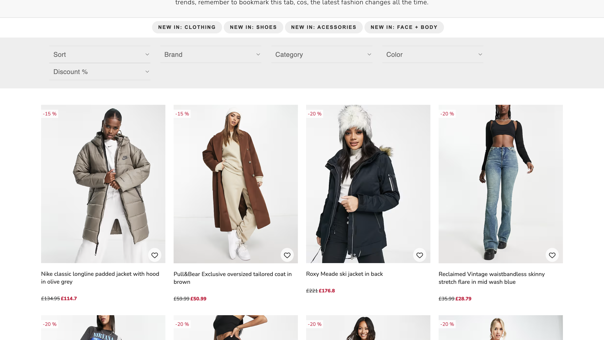
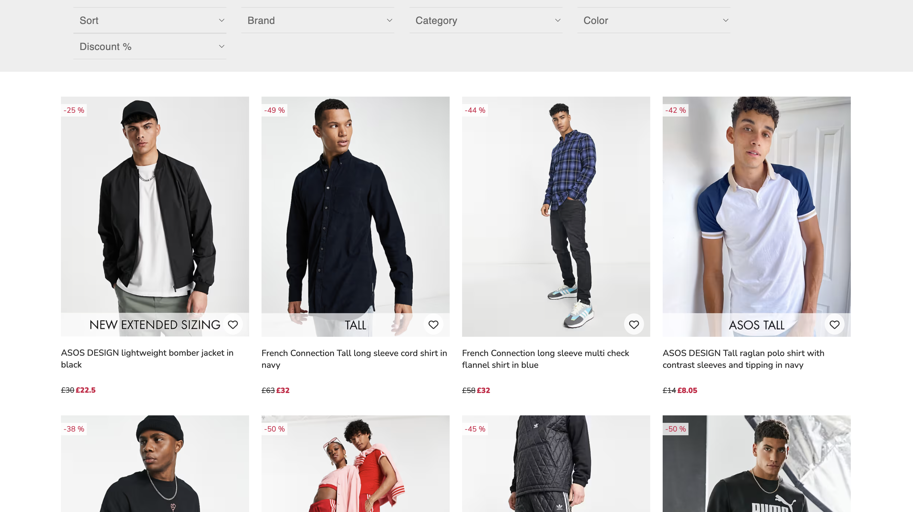
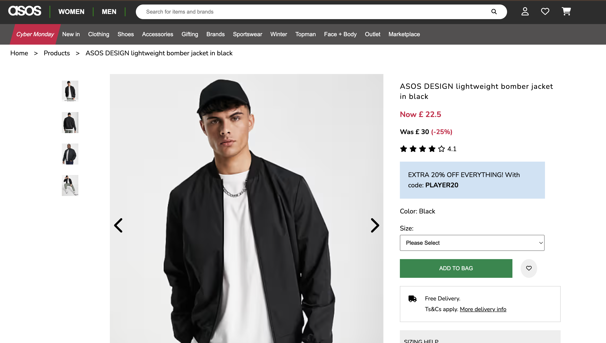
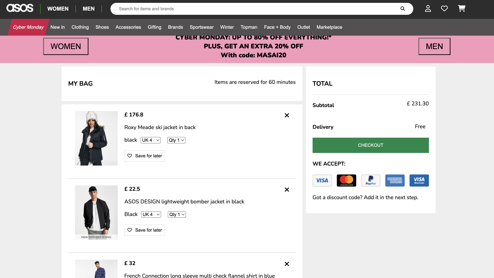
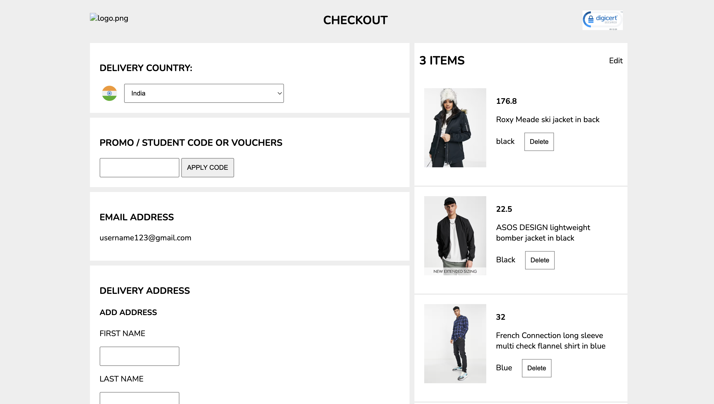

# 👗 ASOS Clone

A responsive e-commerce web application inspired by **ASOS**, one of the world's leading online fashion and beauty retailers. The application allows users to browse fashion products, filter and sort items, view detailed product information, manage their shopping cart and wishlist, and experience a seamless online shopping journey.

---

## 📖 About the Project

**ASOS Clone** is a frontend e-commerce application that replicates the core shopping experience of the ASOS platform. Users can explore a wide collection of men's and women's fashion products, search for items, apply filters and sorting options, and view detailed product information before making a purchase.

The application also includes essential e-commerce functionalities such as wishlist management, shopping cart, and checkout flow. **JSON Server** is used as a mock backend to provide REST APIs for product and user data, while **HTML**, **CSS**, and **JavaScript** power the frontend.

---

## ✨ Features

- 🏠 Attractive Landing Page with dedicated Men's and Women's sections
- 🔍 Product Search Functionality
- 👔 Men's Product Listing Page
- 👗 Women's Product Listing Page
- 🎯 Multiple Filters and Sorting Options
- 📦 Individual Product Details Page
- 🖼️ Product Image Carousel
- ❤️ Wishlist Functionality
- 🛒 Add to Cart
- 💳 Cart Summary Page
- ✅ Checkout Page
- 📱 Responsive User Interface

---

## 🛠️ Tech Stack

| Category | Technologies |
|----------|--------------|
| **Frontend** | HTML5, CSS3, JavaScript (ES6) |
| **Backend (Mock API)** | JSON Server |

---

## ⚙️ Setup Instructions

### Prerequisites

Make sure you have the following installed:

- Node.js (v14 or above)
- npm

### 1. Clone the Repository

```bash
git clone https://github.com/your-username/asos-clone.git
```

### 2. Navigate to the Project Directory

```bash
cd asos-clone
```

### 3. Install Dependencies

```bash
npm install
```

### 4. Start the Mock Backend

Run the following command to start the JSON Server:

```bash
npx json-server --watch db.json --port 8080
```

The mock API will be available at:

```
http://localhost:8080
```

### 5. Launch the Application

Open the `index.html` file in your browser, or use a local development server such as **Live Server** in Visual Studio Code for the best development experience.

> **Note:** Ensure the JSON Server is running before interacting with product data, cart, or wishlist features.

---

## 📸 Application Preview

### Landing Page


### Products Listing Page (Women's)



### Products Listing Page (Men's)



### Product Details Page



### Cart Page



### Checkout Page

